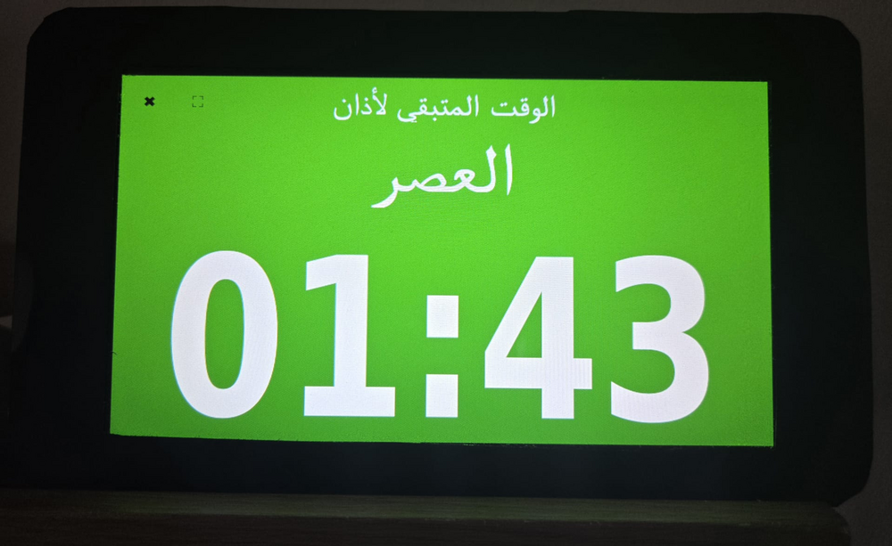
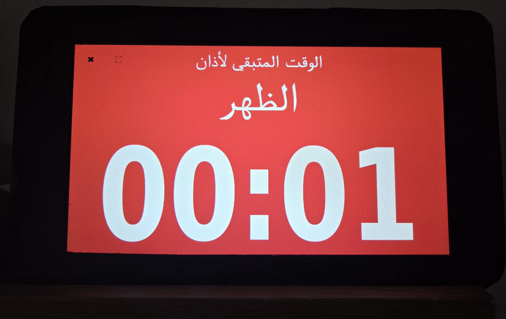
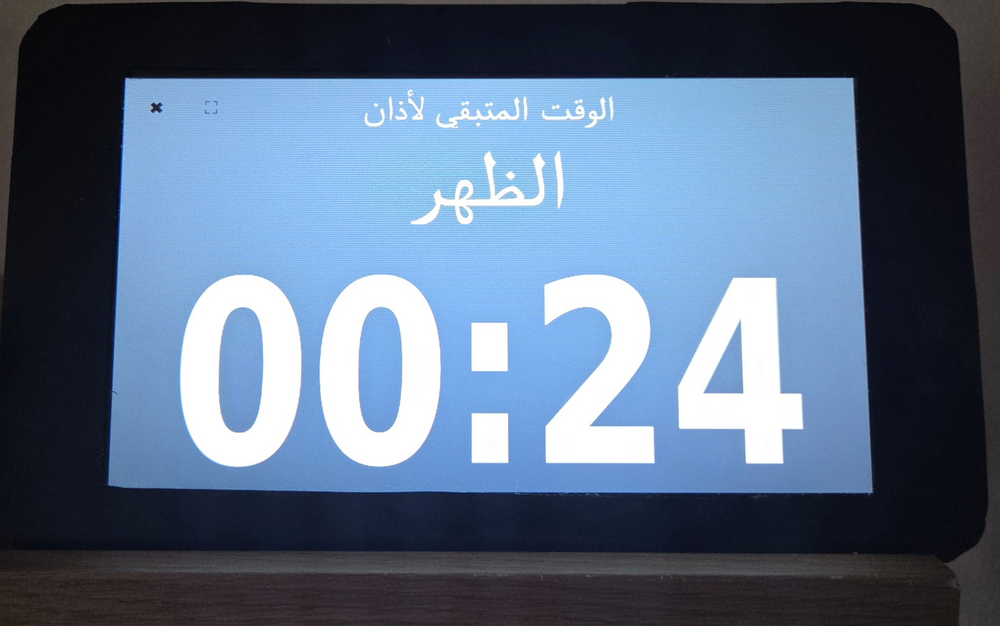

# 🕌 Prayer Scheduler & Audio Player

## Overview

This project provides a comprehensive desktop and background service solution for managing Islamic prayer times and associated audio playback. It is designed to be flexible, configurable, and suitable for different countries and cities by allowing custom prayer time schedules.

The system supports automatic audio playback for prayers, nawafel, athkar, and Quran recitation, along with desktop applications for monitoring prayer times and managing settings.

---

## Features

- **Athan Audio Playback**
  - Automatically plays Athan audio at each prayer time.

- **Nawafel, Athkar, and Quran Audio Player**
  - Supports audio playback for:
    - Duha
    - Tahajjud
    - Athkar Al-Sabah & Al-Masa
    - Custom Quran playlists

- **Prayer Time Countdown Desktop Application**
  - Displays a live countdown for the next prayer time.
  - Visual indicators:
    - 🟢 Green background: first 20 minutes after prayer time starts
      
    - 🔴 Red background: last 20 minutes before the next prayer
      
    - ⚪ Gray background: time between these two periods
      

- **Scheduler Settings Desktop Application**
  - Allows users to configure:
    - Which audio files are played
    - Which events trigger playback
    - Playback timing for nawafel, athkar, and Quran

---

## Prayer Time Configuration

Users can provide custom prayer times using a CSV file.
This allows the system to work for any country or city.

### CSV Format
```
Month,Day,Fajr,Sunrise,Dhuhr,Asr,Maghrib,Isha
```

### Sample

```
Month,Day,Fajr,Sunrise,Dhuhr,Asr,Maghrib,Isha
1,1,06:10,08:10,12:15,13:50,16:09,17:55
1,2,06:10,08:10,12:15,13:51,16:10,17:56
1,3,06:10,08:10,12:16,13:52,16:11,17:57
1,4,06:10,08:10,12:16,13:53,16:12,17:58
...
```

Note:
All non-prayer events (Nawafel, Athkar, and Quran playback) are configured through the Scheduler Settings GUI Desktop Application.

---

## System Architecture

The system is built on two main pillars:

### 1. Background Services

- Scheduler Service
  - Reads a Python mapping configuration file
  - Iterates through scheduled events
  - Triggers a playback script by passing:
    - Event name
    - List of MP3 audio files

### 2. Desktop Applications

- Prayer Time GUI
  - Displays:
    - Countdown to the next prayer time
    - Color-coded prayer time status (green, gray, red)

- Scheduler Settings GUI
  - Provides full control over:
    - Event-to-audio mapping
    - Playback schedules
    - Custom audio selection

---

## Getting Started

1. Clone this repository

2. Copy one of the scheduler directories to your Raspberry Pi.

3. Follow the instructions in the README.md file inside the selected scheduler directory to complete the setup.

---

## Target Platform

- Raspberry Pi
- Desktop environments supporting GUI applications
